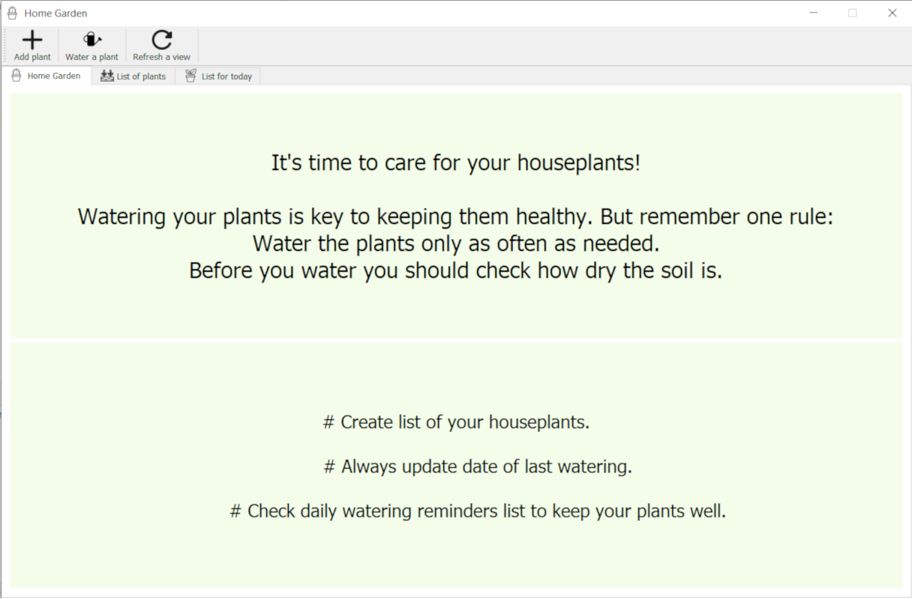
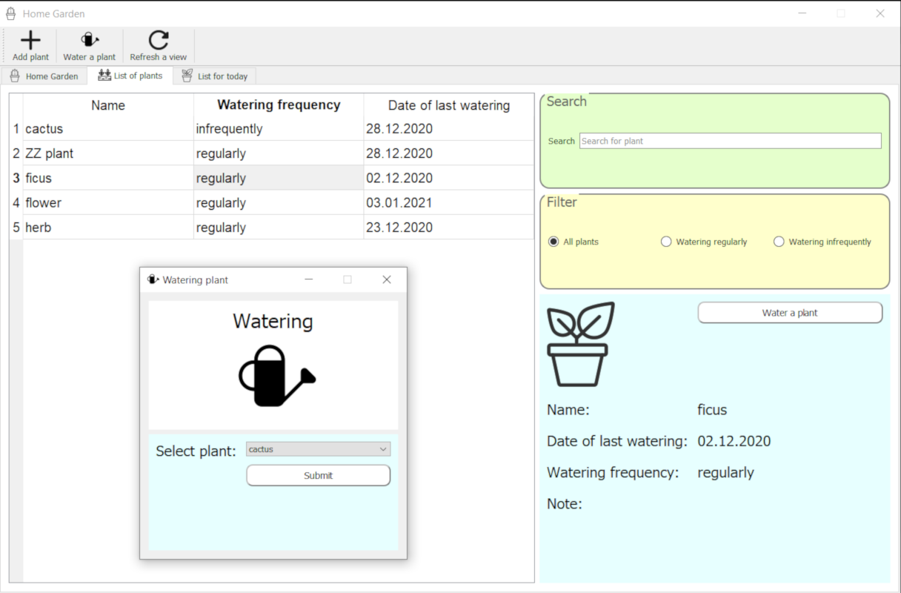
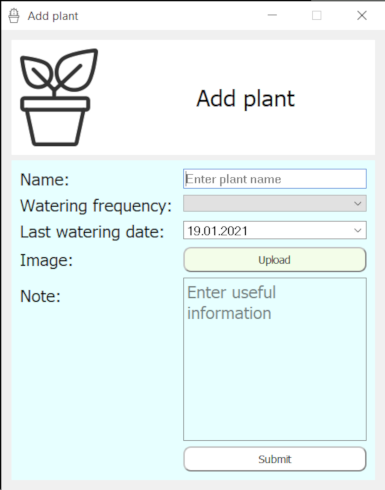

# Home Garden - PyQt5 project
> This is a simple GUI app for assuring that each of your houseplants is watered properly.
## Table of contents
* [Motivation](#motivation)
* [Screenshots](#screenshots)
* [Technologies](#technologies)
* [Features](#features)

## Motivation
This is my first PyQt5 project created to learn the technology.

## Screenshots

## Technologies
* PyQt5 - version 5.15.2

## Features
* Create list of plants: add a photo of your plant, identify its watering frequency and add a note with some useful information.
* Check daily watering reminders list to keep your plants well.
* Keep an eye on plant's date of last watering.